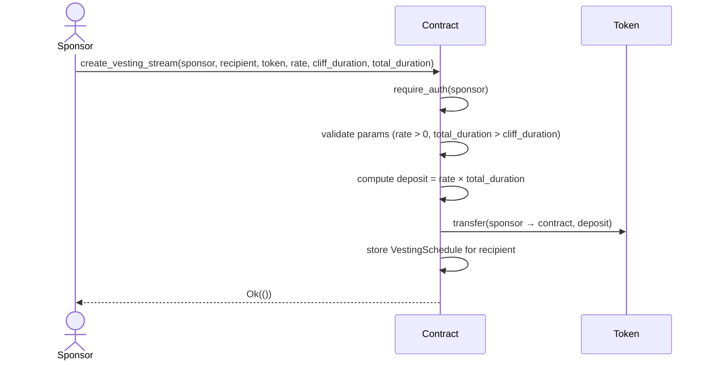
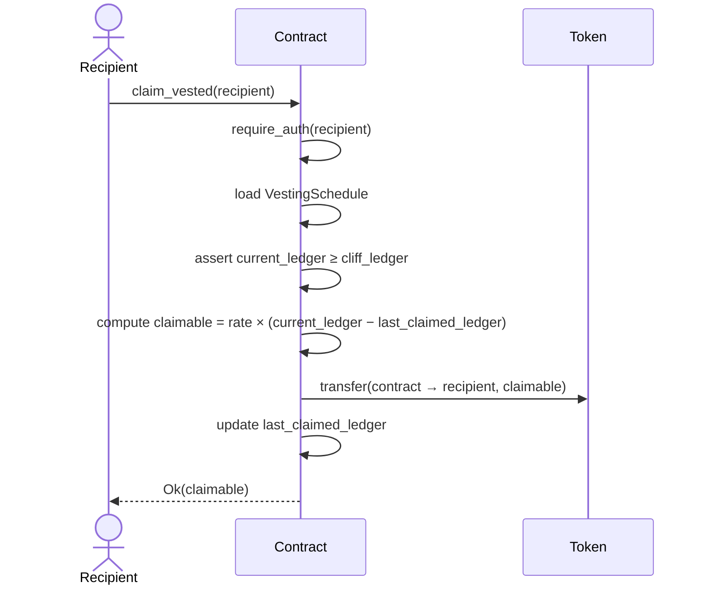
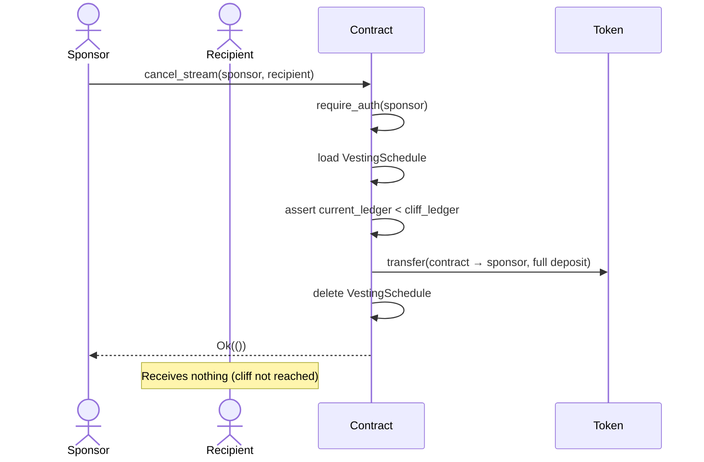
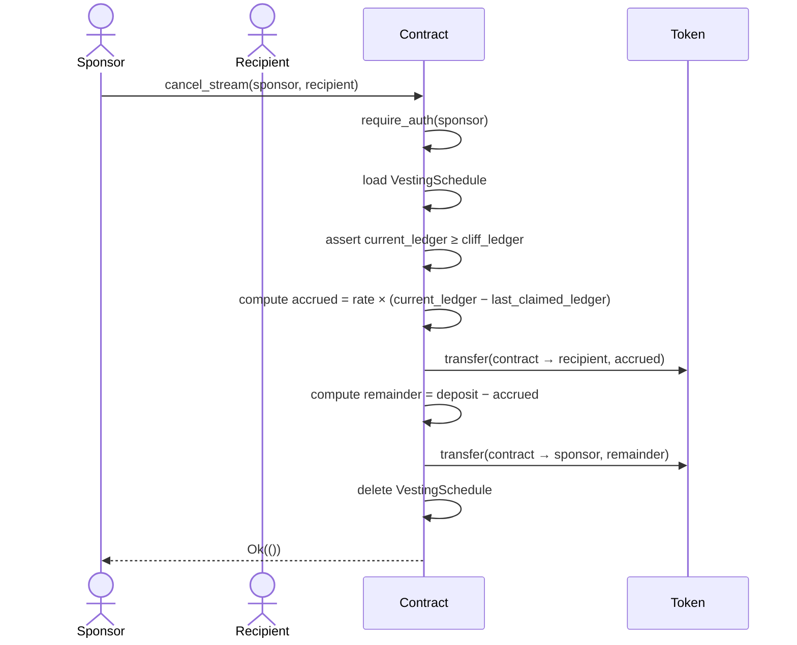

# Contract Flow Diagrams

## 1. Stream Creation

```mermaid
sequenceDiagram
    actor Sponsor
    participant Contract
    participant Token

    Sponsor->>Contract: create_vesting_stream(sponsor, recipient, token, rate, cliff_duration, total_duration)
    Contract->>Contract: require_auth(sponsor)
    Contract->>Contract: validate params (rate > 0, total_duration > cliff_duration)
    Contract->>Contract: compute deposit = rate × total_duration
    Contract->>Token: transfer(sponsor → contract, deposit)
    Contract->>Contract: store VestingSchedule for recipient
    Contract-->>Sponsor: Ok(())
```

## 2. Claim After Cliff

```mermaid
sequenceDiagram
    actor Recipient
    participant Contract
    participant Token

    Recipient->>Contract: claim_vested(recipient)
    Contract->>Contract: require_auth(recipient)
    Contract->>Contract: load VestingSchedule
    Contract->>Contract: assert current_ledger ≥ cliff_ledger
    Contract->>Contract: compute claimable = rate × (current_ledger − last_claimed_ledger)
    Contract->>Token: transfer(contract → recipient, claimable)
    Contract->>Contract: update last_claimed_ledger
    Contract-->>Recipient: Ok(claimable)
```

## 3. Cancel Before Cliff

```mermaid
sequenceDiagram
    actor Sponsor
    actor Recipient
    participant Contract
    participant Token

    Sponsor->>Contract: cancel_stream(sponsor, recipient)
    Contract->>Contract: require_auth(sponsor)
    Contract->>Contract: load VestingSchedule
    Contract->>Contract: assert current_ledger < cliff_ledger
    Contract->>Token: transfer(contract → sponsor, full deposit)
    Contract->>Contract: delete VestingSchedule
    Contract-->>Sponsor: Ok(())
    Note over Recipient: Receives nothing (cliff not reached)
```

## 4. Cancel After Cliff

```mermaid
sequenceDiagram
    actor Sponsor
    actor Recipient
    participant Contract
    participant Token

    Sponsor->>Contract: cancel_stream(sponsor, recipient)
    Contract->>Contract: require_auth(sponsor)
    Contract->>Contract: load VestingSchedule
    Contract->>Contract: assert current_ledger ≥ cliff_ledger
    Contract->>Contract: compute accrued = rate × (current_ledger − last_claimed_ledger)
    Contract->>Token: transfer(contract → recipient, accrued)
    Contract->>Contract: compute remainder = deposit − accrued
    Contract->>Token: transfer(contract → sponsor, remainder)
    Contract->>Contract: delete VestingSchedule
    Contract-->>Sponsor: Ok(())
```
